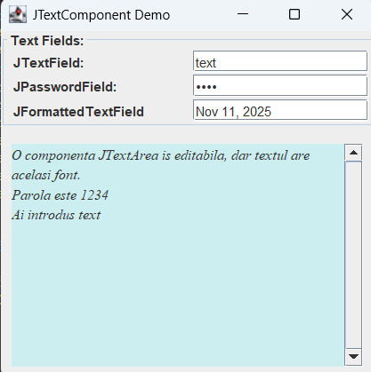

# Java Swing Text Components Demo

This project demonstrates the use of various **Swing text components** such as:
- `JTextField`
- `JPasswordField`
- `JFormattedTextField`
- `JTextArea`

The interface allows user input and dynamically displays text and passwords entered in the fields.

## 🖥 Preview

Below is an example of the running window created by the program:

## 💡 Features
- Interactive text fields and password input.
- Dynamic text updates in the `JTextArea`.
- Example of layout management with `GridLayout` and `BorderLayout`.
- GUI built using **Eclipse IDE**.

## 🚀 How to Run
1. Open the project in **Eclipse**.
2. Run the `JTextComponentDemo.java` file as a **Java Application**.

---

✅ *Created using Java 21 and Eclipse IDE.*